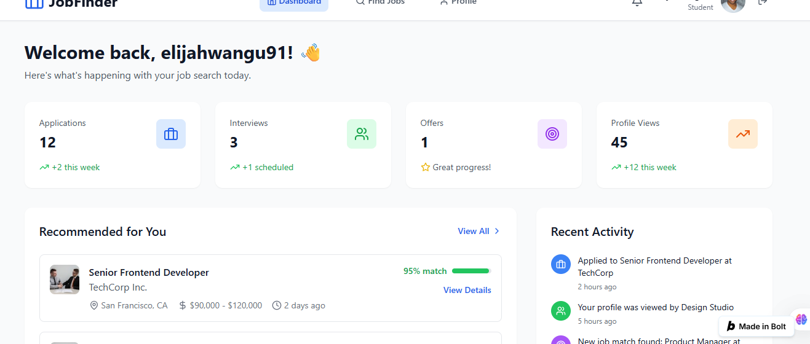
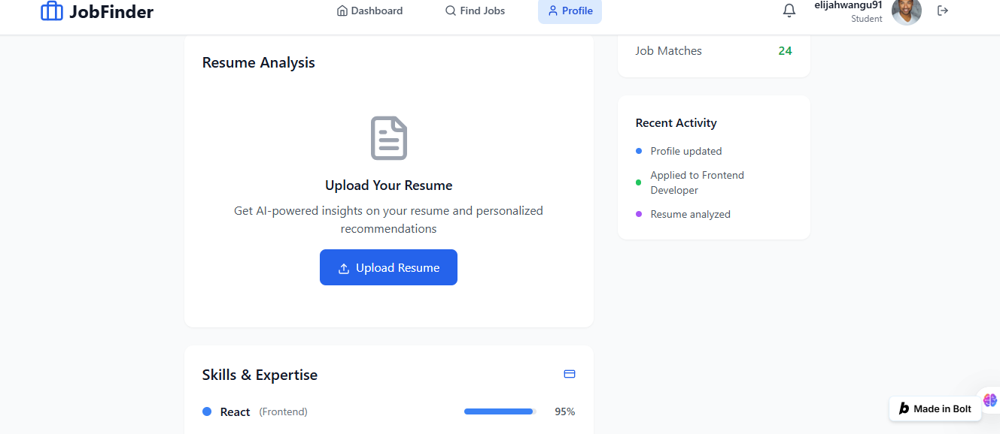
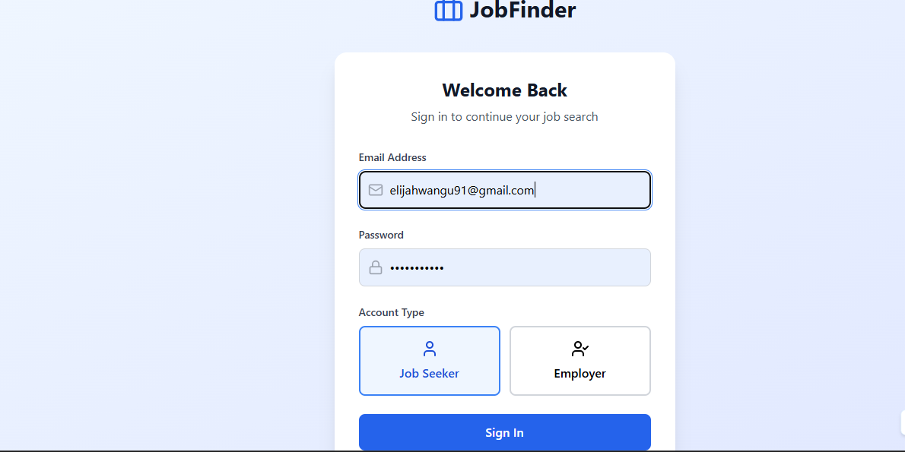

# 📌 Smart Resume Analyzer

An **AI-powered resume analysis and job matching platform** built with **React, Node.js/Express, MySQL, Tailwind, Bootstrap, and AI APIs**.  
The platform enables students to upload resumes, receive **AI-driven career insights**, and match with relevant jobs or internships.

---

## 📸 Screenshots

<div style="display: flex; gap: 10px;">
  
  ### Dashboard
  
  ### Job Listing
  
  ### Resume Analysis
  
  ### sign up
</div>

---

## 🚀 Features

### 👤 User Features
- **Sign Up / Login** (secure authentication)
- **Profile Management** (personal info + resume upload)
- **Resume Upload** (PDF/DOCX)
- **Job Search & Filters** (by title, location, skills)
- **AI Resume Analysis**
  - Extract skills & experiences from CV
  - Identify missing skills
- **AI Job Matching**
  - Match percentage between user CV and job descriptions
- **AI Cover Letter Generator (optional)**
  - Auto-generate a draft cover letter based on CV + job
- **Career Recommendations**
  - Suggest courses or skills for career growth

### 👨‍💼 Admin Features
- Post new jobs or internships
- Manage job listings
- View applications and candidate match scores

---

## 🛠️ Tech Stack

### Frontend
- **React.js** → User interface (dashboard, job listing, resume upload)
- **Tailwind CSS + Bootstrap** → Styling and responsive UI

### Backend
- **Node.js + Express** → API server
- **MySQL** → Database for users, resumes, jobs, applications, and AI feedback

### AI Integration
- **AI APIs (e.g., OpenAI GPT or Hugging Face)**
  - Resume parsing & analysis
  - Job matching recommendations
  - Cover letter generation

---

## 🗂️ Project Structure

smart-resume-annalyzer/
│
├── server/ # Node.js + Express API
│   ├── routes/ # API routes (auth, jobs, resume, AI)
│   ├── models/ # Database models (MySQL)
│   ├── controllers/ # Logic for routes
│   ├── config/ # DB & API configs
│   └── index.js # Express app entry point
│
├── client/ # React app
│   ├── src/
│   │   ├── components/ # React components
│   │   ├── pages/ # Pages (Login, Dashboard, Jobs)
│   │   ├── api/ # API calls to backend
│   │   └── App.js # Main app
│
├── sql/ # SQL scripts for schema
│   └── schema.sql
│
├── README.md
└── package.json

---

## 🔑 Key API Endpoints

### Authentication
- `POST /api/auth/register` → Create user
- `POST /api/auth/login` → Login user

### Jobs
- `GET /api/jobs` → Fetch all jobs
- `POST /api/jobs` → Add new job (admin)
- `GET /api/jobs/:id` → Fetch single job

### Resume
- `POST /api/resume/upload` → Upload resume
- `POST /api/resume/analyze` → Send resume text to AI API for skill extraction

### AI Matching
- `POST /api/match` → Compare resume vs job description → return match % + recommendations
- `POST /api/cover-letter` → Generate AI cover letter

---

## ⚡ How It Works (Workflow)

1. User signs up and uploads resume
2. Backend extracts text from resume (using `pdf-parse` or similar)
3. Resume text is sent to **AI API** for:
   - Skills extraction
   - Strengths & weaknesses analysis
   - Suggested improvements
4. User browses jobs → when clicking "Match", resume data + job description are compared via AI API
5. System returns **match score (%) + recommended skills**
6. (Optional) User generates a **cover letter draft** for that job

---

````markdown
## 🛠️ Installation

### 1. Clone the repo
```bash
git clone https://github.com/elijah-dot/smart-resume-annalyzer.git
cd smart-resume-annalyzer
```

### 2. Setup Backend
```bash
cd server
npm install
```
Create a `.env` file in the `server` folder with the following content:
```env
PORT=5000
DB_HOST=localhost
DB_USER=root
DB_PASS=yourpassword
DB_NAME=job_finder
OPENAI_API_KEY=your_openai_api_key
```
Run the backend server:
```bash
npm start
```

### 3. Setup Frontend
```bash
cd ../client
npm install
npm start
```
Frontend runs on [http://localhost:3000](http://localhost:3000).

---

## 🌐 Live Demo & Contact

- **Live Link:** [https://ai-powered-job-match-olox.bolt.host/]
- **Project Owner:** [Elijah Mwangi Wangu]
- **Contact Email:** [elijahwangu91@gmail.com]

